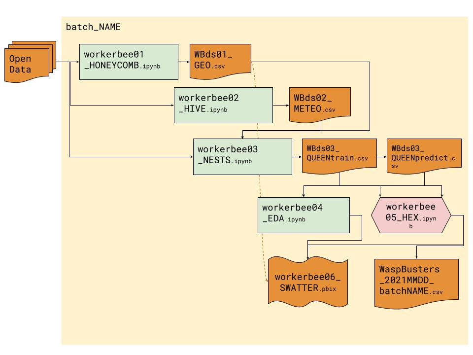

# KopuruVespaCompetitionIE — WaspBusters

IE Business School team (**WaspBusters**) entry for the [**2021 Kopuru Vespa Velutina**](https://kopuru.com/desafio/vespa-velutina/) data science competition — predicting invasive Asian hornet (*Vespa velutina*) nest locations in Spain.

🏆 **Award-winning submission.** Final presentation delivered at IE's Data Science Bootcamp:  
[▶ Watch the final presentation (YouTube)](https://www.youtube.com/live/23Fua779WEA?si=haThQVCd2pDfZfPt&t=5671)

> Preserved for portfolio reference. Competition concluded in 2021; not actively maintained.

---

## About the competition

The [Kopuru Vespa Velutina challenge](https://kopuru.com/desafio/vespa-velutina/) tasked teams with building a predictive model to identify likely locations of invasive hornet nests, using open geospatial and environmental data. The goal: support public authorities in prioritising inspection resources.

## Our approach (the Beeswax workflow)



Each submission followed this script+data pipeline:

1. Ingest and clean open geospatial datasets
2. Feature engineering (environmental, spatial, temporal)
3. Model training and iteration (XGBoost, etc.)
4. Submit predictions to Kopuru platform
5. Evaluate leaderboard score and iterate

## Repository structure

```
KopuruVespaCompetitionIE/
├── A_Wasp_nests_prediction_model/   # Model scripts and feature engineering
├── B_Submissions_Kopuru_competition/ # Submission batches and workflow diagram
├── C_IE_bootcamp_presentations/     # Final bootcamp presentation (PDF)
├── Input_open_data/                 # Source datasets used
└── Other_open_data/                 # Supplementary data sources
```

## Stack

- Python (Pandas, scikit-learn, XGBoost, geopandas)
- Jupyter Notebooks / JupyterLab
- Data: open geospatial sources (sightings, environmental, administrative)

## Team

IE Business School Data Science Bootcamp cohort, Jan 2021 — team **WaspBusters**.

---

## Development environment setup (historical reference)

The team used JupyterLab with the Git extension on Windows/Anaconda. If reproducing locally:

1. Install [Anaconda](https://www.anaconda.com/)
2. `conda install -c conda-forge jupyterlab-git nodejs`
3. Clone this repository and open in JupyterLab
4. Install additional dependencies: `geopandas`, `datawig`, `xgboost`
